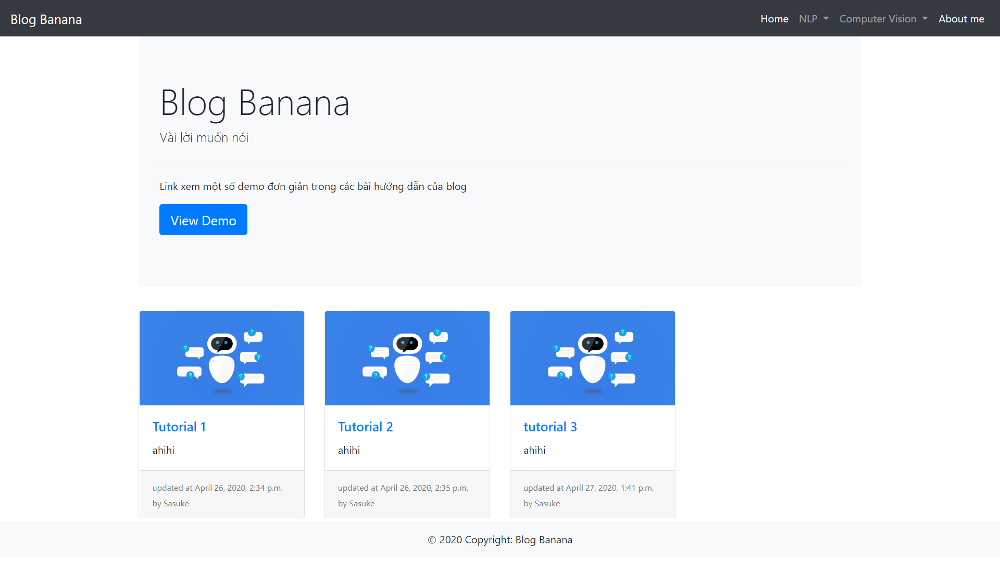
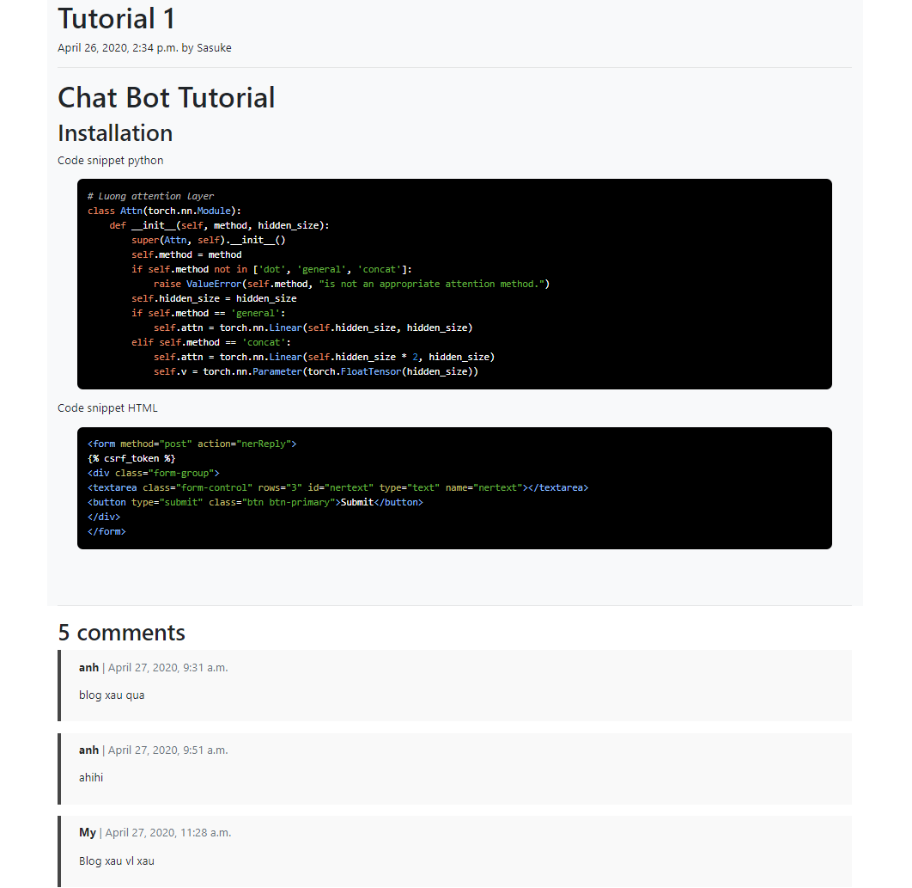

# blog
## Installation
- git clone https://github.com/trantuananhvn93/blog.git
- pip install -r requirements.txt
- python manage.py makemigrations
- python manage.py migrate
- python manage.py loaddata db.json
- python manage.py runserver

## Screenshot

HomePage:

Article Page:

Demo Pages:

